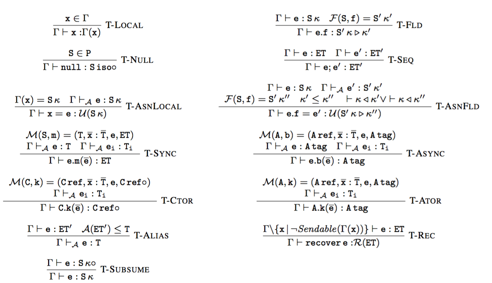
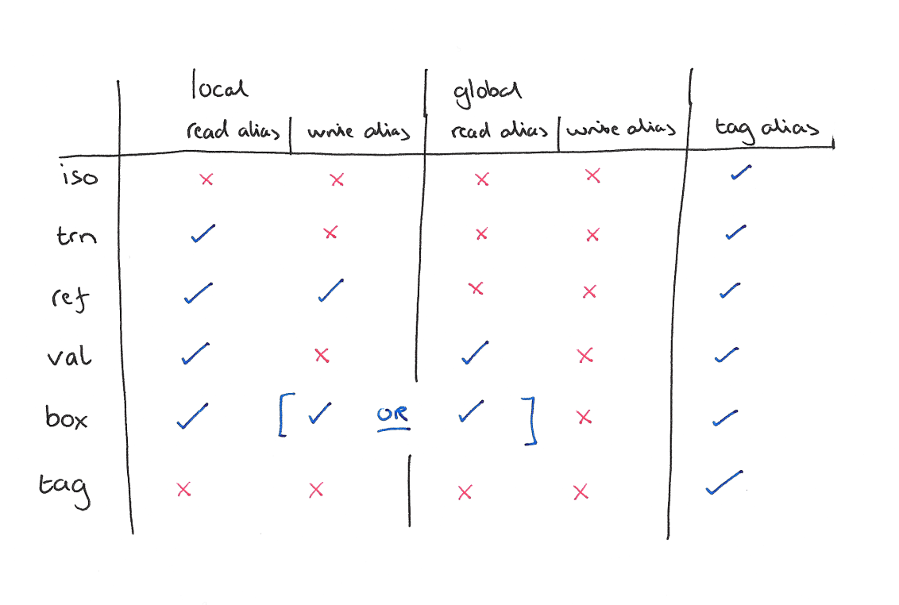

## Pony for Fintech

or

#### How I Stopped Worrying and Learned to Love an Exotic Product

-----

Sylvan Clebsch

QCon London 2016

---

### My talks are usually a bit...



----

### Today is more...

```c
bool messageq_push(messageq_t* q, pony_msg_t* m)
{
  m->next = NULL;

  pony_msg_t* prev = (pony_msg_t*)_atomic_exchange(&q->head, m);

  bool was_empty = ((uintptr_t)prev & 1) != 0;
  prev = (pony_msg_t*)((uintptr_t)prev & ~(uintptr_t)1);

  _atomic_store(&prev->next, m);

  return was_empty;
}
```

---

### Code "asset classes"

High Frequency Trading

Risk Engines

Trade Surveillance

Aggregate Limits Checks

Matching Engines (FX, Dark Pool, Exchange, etc.)

Pricing Engines

----

### Common elements

Mostly Java or C++

Niche languages: Scala, OCaml, Erlang, C, R, NumPy

Performance critical

Not formally verified

----

### What is "performance"?

Latency?

Throughput?

Uptime?

Graceful degradation?

Hit rate?

Best execution?

Profit?

----

### Performance = Profit

Fintech has a narrow world view, but it gives a precise definition of performance

---

### What do we want?

Tools that help us exploit our domain knowledge to write profit-maximising systems.

Examples:

* Aeron
* Cap'n Proto
* OpenOnload

----

### How do those tools help?

Each tool manages a collection of hard problems

They aren't single purpose mini-libraries

They completely encapsulate the solution

They are not drop-in replacements for existing code

----

### A programming language is just another tool

It's not about syntax

It's not about expressiveness

It's not about paradigms or models

It's about managing hard problems

---

### Using Pony to manage hard problems

Zero-copy fast message queues

Workstealing topology-aware scheduling

Fully concurrent GC with no stop-the-world

----

### What Pony looks like

This is a complete echo server

```pony
use "net"

actor Main
  new create(env: Env) =>
    TCPListener(Listener(env.out))

class Listener is TCPListenNotify
  let _out: OutStream
  var _host: String = ""
  var _port: String = ""

  new iso create(out: OutStream) =>
    _out = out

  fun ref listening(listen: TCPListener ref) =>
    try
      (_host, _port) = listen.local_address().name()
      _out.print("listening on " + _host + ":" + _port)
    else
      _out.print("couldn't get local address")
      listen.close()
    end

  fun ref not_listening(listen: TCPListener ref) =>
    _out.print("couldn't listen")
    listen.close()

  fun ref connected(listen: TCPListener ref) : TCPConnectionNotify iso^ =>
    Server(_out)

class Server is TCPConnectionNotify
  let _out: OutStream

  new iso create(out: OutStream) =>
    _out = out

  fun ref accepted(conn: TCPConnection ref) =>
    _out.print("connection accepted")

  fun ref received(conn: TCPConnection ref, data: Array[U8] iso) =>
    _out.print("data received, looping it back")
    conn.write("server says: ")
    conn.write(consume data)

  fun ref closed(conn: TCPConnection ref) =>
    _out.print("server closed")
```
<!-- .element: class="stretch"-->

----

### What I'll be talking about

Runtime implementation details

Brief asides on how the type system helps the runtime

TODO:

----

### What I won't be talking about

TODO:

---

### Zero-copy fast message queues

Built on two things:

1. Queue implementation
2. Data-race free type system

----

### Intrusive unbounded MPSC queue

Intrusive: messages do not need to be in more than one queue

Unbounded: controversial!

----

### Why unbounded?

If the queue was bounded, what would we do when the queue was full?

Block or fail?

Blocking can deadlock and introduce unbounded producer jitter

Failing means application-specific failure handling for every message send

----

### Unbounded queues move the back pressure problem

They don't make it better

They don't make it worse

We'll return to back pressure later

----

### Pushing a message on to a queue

```c
bool messageq_push(messageq_t* q, pony_msg_t* m)
{
  m->next = NULL;

  pony_msg_t* prev = (pony_msg_t*)_atomic_exchange(&q->head, m);

  bool was_empty = ((uintptr_t)prev & 1) != 0;
  prev = (pony_msg_t*)((uintptr_t)prev & ~(uintptr_t)1);

  _atomic_store(&prev->next, m);

  return was_empty;
}
```

TL;DR: single atomic operation, wait-free, integrated empty queue detection

----

### Popping a message off of a queue

```c
pony_msg_t* messageq_pop(messageq_t* q)
{
  pony_msg_t* tail = q->tail;
  pony_msg_t* next = _atomic_load(&tail->next);

  if(next != NULL)
  {
    q->tail = next;
    pool_free(tail->size, tail);
  }

  return next;
}
```

TL;DR: zero atomic operations, stub nodes for memory management

----

### Zero-copy messages

The type system guarantees the program is data-race free

Messages can be passed by reference instead of being copied

Without locking or atomic reference counting

---

### Data-race free type system

Pony uses a system called reference capabilities (rcaps) to express isolation and immutability

These can guarantee at compile time that your program is data-race free

----

### Rcaps: the short version

Every reference to an object indicates a level of isolation or immutability

```pony
x: Foo iso // An isolated Foo
x: Foo val // An immutable Foo
x: Foo ref // A mutable Foo
```

This affects how you can use a reference (read, write, alias, send)

----

### Rcaps: it's about deny, not allow

Rather than grant permissions, an rcap prevents certain kinds of other rcaps to the same object

This is used to enforce the golden rule of data-race freedom:

"If I can write to it, nobody else can read from it"

----

### Adrian Colyer from the Morning Paper



----

### Rcaps: local typing, not global analysis

Data-race freedom using rcaps is handled by the compiler during type checking

There is no global static analysis step

Ensuring data-race freedom doesn't get harder for the compiler as your code base grows

---

### Workstealing topology-aware scheduling

---

### Fully concurrent GC with no stop-the-world

---

## Come get involved!

Join our community of industry developers, tooling developers, library writers, compiler hackers, type system theorists, students, and hobbyists.

Why not you?

http://ponylang.org
