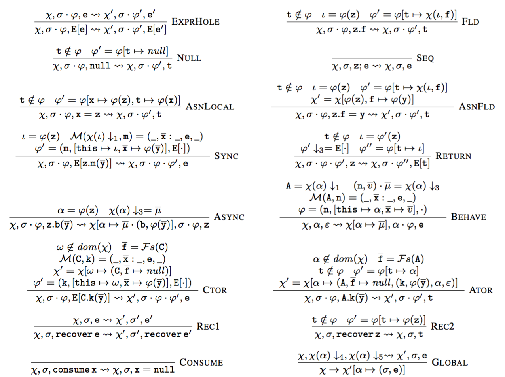
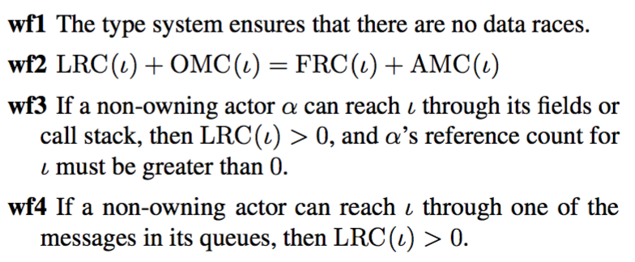
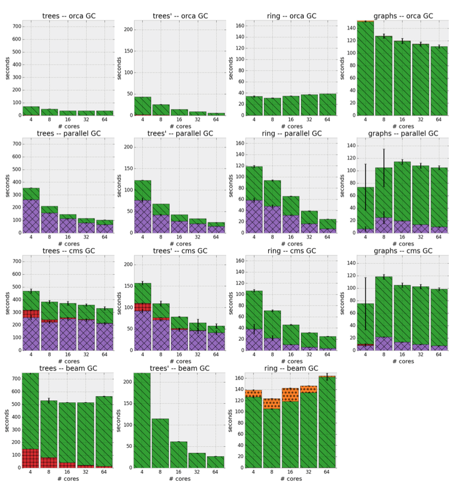
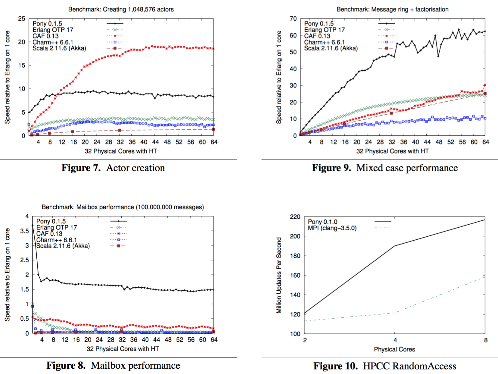

### Pony: Co-Designing a Type System and a Runtime

Sylvan Clebsch

Microsoft Research

November 4th, 2016

-----

Presenting at SPLASH-I 2016, Amsterdam

---

### My background

24 years of industry programming

Electronic trading, online video games, crypto tools, physics modelling, rendering engines, military sims, VOIP, peer routing, embedded operating systems.

----

### These all have something in common

Performance critical

Benefit from concurrency

Most are actually distributed systems...

<!-- .element: class="fragment"--> _...even if I didn't realise that when writing them_

----

### The work: Pony

An actor-model capabilities-secure native programming language

Designed to "scratch my own itch"

----


---

### What is Pony?

An actor-model capabilities-secure general-purpose native language

```pony
actor Main
  new create(env: Env) =>
    env.out.print("Hello, Cambridge!")
```

----

### Goals

Statically data-race free, with mutability

No-stop-the-world garbage collection

Formally specified

Single node performance competitive with C/C++

Distributed computing

----

### Some good domains for Pony

Financial systems

Video games

Stream processing

Machine learning

Low-power devices (speed is energy efficiency)

Operating systems

----

### There's a lot in Pony

Today will be an overview of the features most interesting for distributed computing: data-race freedom and GC

Some of the things that won't get mentioned: generics, intersection types, nominal and structural subtyping, pattern matching, queue design, scheduling and work-stealing, and more

----

### STOP!

Are you interested in one of the things I just said won't get mentioned?

Speak up now, and I can change what I cover!

---

### Let's walk through that example

```pony
actor Main
  new create(env: Env) =>
    env.out.print("Hello, Cambridge!")
```

`env` is an _immutable environment_ that encapsulates command line arguments, environment variables, `stdin`, `stdout`, `stderr`

There are no globals, as globals represent _ambient authority_

Access to `stdout` must be passed to any function that needs it

----

### Capabilities security

Originally operating system based: KeyKOS, EROS, Coyotos, seL4

Expanded to programming languages with _object capabilities_ (ocaps): E, AmbientTalk, Caja

Pony is an ocap language: `env` is an ocap for the initial environment

----

### Reference capabilities

Pony extends ocaps with _reference capabilities_ (rcaps)

For example, the immutability of `env` is an rcap: more on this later!

----

### Actor model

```pony
actor Main
  new create(env: Env) =>
    env.out.print("Hello, Cambridge!")
```

`env.out` is an _actor_ that encapsulates `stdout`

Instead of locking `stdout` to print, a message is sent to the actor containing what is to be printed

Here, the message is `print` and we print `"Hello, Cambridge!"`

----

### Actor model history

Starts with Carl Hewitt in 1973

Gul Agha's 1985 thesis provided a foundational model

Closely connected to CSP, pi-calculus, join-calculus

Some other actor languages: Erlang, E, AmbientTalk

Some actor libraries: Akka, Orleans, ActorFoundry, CAF

----

### Why is it safe to send a String in a message?

```pony
actor Main
  new create(env: Env) =>
    env.out.print("Hello, Cambridge!")
```

Here, we are passing a string literal, which has the type `String val`

The `val` means it is a _globally immutable_ `String`: there can be no writeable aliases to the object

It's safe to send `val` references in messages: there will be no data races

`val` is a _reference capability_ (rcap)

----

### What about sending mutable data in messages?

```pony
actor TCPConnection
  new create(notify: TCPConnectionNotify iso,
    host: String, service: String, from: String = "")
```

When creating a `TCPConnection`, we attach a `TCPConnectionNotify` that will be called when events occur on the connection

`notify` may need to mutate its state: for example, it may do stateful protocol decoding

----

### Isolation for data-race free mutability

```pony
actor TCPConnection
  new create(notify: TCPConnectionNotify iso,
    host: String, service: String, from: String = "")
```

To make this safe, `TCPConnection` requires that `notify` is _isolated_ (`iso`).

`iso` guarantees there are no readable or writeable aliases to the object

It's safe to send `iso` references in messages

----

### Using `tag` to express identity

```pony
actor Timers
  be apply(timer: Timer iso)
  be cancel(timer: Timer tag)
```

When setting up a `Timer`, a `Timers` actor represents a set of hierarchical timing wheels and manages the underlying OS timer mechanism

A `Timer` is mutable, not only to change when it next fires, but because it holds a mutable `TimerNotify` that is informed of events that may in turn hold mutable state

----

### `tag` is compatible with `iso`

```pony
actor Timers
  be apply(timer: Timer iso)
  be cancel(timer: Timer tag)
```

We can send a `Timer iso` to another actor while safely keeping a `tag` alias: `tag` is opaque, allowing neither reading from nor writing to the object

Sending a `tag` in a message is also safe: an opaque reference can't be the source of data races

----

### Using `tag` to type actors

```pony
actor Main
  new create(env: Env) =>
    env.out.print("Hello, Cambridge!")
```

Here, the `env.out` actor is a `StdStream tag`

Sending an asynchronous message involves neither reading from nor writing to the receiver's state

----

### Actors are part of the rcap system

```pony
actor Timers
  be apply(timer: Timer iso) =>
    """
    Sets a timer. Fire it if need be, schedule it on the
    correct timing wheel, then rearm the timer.
    """
    let timer': Timer ref = consume timer
    _map(timer') = timer'
    timer'._slop(_slop)
    _fire(timer')
    _advance()
```

Here we see a behaviour (`be`) that handles the `apply` message

When a behaviour executes, the receiver (`this`) is typed as `ref`: the actor can freely mutate its own state

---

### Data-race freedom

> "If I can write to it, nobody else can read from it"

Corollary:

> "If I can read from it, nobody else can write to it"

----

### Existing data-race freedom work

Gordon, Parkinson, Parsons, Bromfield, Duffy: _Uniqueness and reference immutability for safe parallelism_

Östlund, Wrigstad, Clarke, Åkerblom: _Ownership, uniqueness, and immutability_

Haller, Odersky: _Capabilities for uniqueness and borrowing_

Srinivasan, Mycroft: _Kilim: Isolation-typed actors for java_

Wadler: _Linear types can change the world_

Rust: mixed static/dynamic data race freedom

----

### Deny rather than allow

Pony's _reference capabilities_ (rcaps) express what other aliases cannot exist, both locally and globally

Alias denial appears to be more fundamental than permissions

----

### Deny matrix

| Deny global | aliases | |
-----------------------|--------------|-------------|-----
__Deny local aliases__ | _Read/Write_ | _Write_     | _None_
_Read/Write_           | __*iso*__    |             |
_Write_                | __trn__      | __*val*__   |
_None_                 | __ref__      | __box__     | __*tag*__
                       | _mutable_    | _immutable_ | _opaque_

----

### Rcap compatibility

Adrian Colyer's chart from The Morning Paper


----

### Rcaps and viewpoint adaptation

```pony
class HashMap[K, V, H: HashFunction[K] val]
  fun apply(key: box->K!): this->V ?
```

Here, `key` is any _alias_ (`!`) of how a _readable_ (`box`) type would see the unconstrained type variable `K`

The return value is how the receiver sees the type variable `V`

`apply` is a _partial function_ (`?`): this is how exceptions work in Pony

----

### Rcaps, ephemerality, algebraic data types

```pony
class HashMap[K, V, H: HashFunction[K] val]
  fun ref update(key: K, value: V): (V^ | None) =>
```

In contrast, in `update` an actual `K` is required, as the `HashMap` will store it

The return value is either an _ephemeral_ (`^`) `V`, indicating that one alias has been removed (the one the `HashMap` previously held, if any), or `None` if no value was previously associated with the key

----

### An example of ephemerality

```pony
let ant: Ant val = ...
let map: HashMap[String, Aardvark iso] = ...
map("bob").eat(ant) // ok
let bob1: Aardvark iso = map("bob") // bad!
let bob2: Aardvark tag = map("bob") // ok
let bob3: Aardvark iso = map.remove("bob") // ok
```

We can lookup Bob the Aardvark and call `iso`-safe functions on the result

But we can't take an alias to Bob, except as a `tag`

But we could remove Bob from the map entirely

---

### Formalism at the root

There has been a tight feedback loop between research and development

The formalism has improved the implementation

The implementation has improved the formalism

----

### Operational semantics



----

### Type system


---

### Leveraging the type system in the runtime

Types as guarantees help reasoning

Those same guarantees can be used in the runtime implementation

_Type systems can improve performance_

----

### What parts of the runtime are faster due to the type system?

Memory allocator

Garbage collector

Message queues

Work-stealing scheduler

Asynchronous I/O

---

### Garbage collection

How can we leverage the actor-model and data-race freedom to build a highly efficient, no-stop-the-world GC?

----

### Per-actor heaps

Start with a separate heap per actor, like Erlang

Use a mark-and-don't-sweep, non-incremental, non-generational, non-copying collector

No read or write barriers, no card table marking, no pointer fixups

Don't touch unreachable memory, avoiding cache pollution

Handle fragmentation with a size-classed pooled memory allocator

----

### Sharing references across actors

Data-race freedom allows zero-copy messaging

How do we prevent premature collection of objects sent to other actors?

With no synchronisation, including no round-trip message passing?

---

### ORCA: fully concurrent object GC for actors

A variant of deferred distributed weighted reference counting

Ref counts do not depend on the shape of the heap, only on how many times an object has been sent or received by an actor

----

### How it works

1. When an actor sends a reference to an object in a message, it increments its own reference count for that object
2. When an actor receives a reference to an object in a message, it decrements its own reference count for that object
3. Increments and decrements are reversed if the object was not allocated on the actor's heap

----

### ORCA messages: inventing and discarding reference counts

When an actor does local GC and discovers it can no longer reach an object allocated on another actor's heap, the GC'ing actor sends a decrement message to the object's allocating actor

When an actor wants to send a reference to an object allocated on another actor's heap but has only 1 RC for that object, it sends an increment message to the object's allocating actor

No confirmation or round-trip is required for either operation

----

### The invariants



----

### Why is this efficient?

No stop-the-world GC step

GC messages are aggregated and cheap to send

Per-actor GC gives pseudo-incremental and pseudo-generational behaviour without the usual GC overheads

---

### MAC: message-based actor collection

The ORCA protocol can be used to collect actors themselves

Efficiently determine when an actor not only has no pending messages, but will never again have pending messages

----

### MAC and cycle detection

Since actors have ref counts for objects, ORCA ref counts have no cycles

But when collecting actors themselves, ref count cycles exist

Solution: use an actor that detects isolated graphs of blocked actors

----

### MAC and out-of-date topology views

The actors report their own view of their topology to the cycle detector when they have no work to do (i.e. are blocked)

An actor's view of its own topology may be out-of-date

The cycle detector has a doubly out-of-date view of actor graph topology

----

### Using CNF-ACK to verify topology

When the cycle detector perceives a cycle, it sends a confirmation message (CNF) to each actor in the cycle

Each actor that receives a CNF echos back an ACK to the cycle detector

No other information or decision making is required

----

### What does it mean when the cycle detector receives an ACK?

If the cycle detector has not received an unblock message from that actor, then:

1. The actor's view of its own topology was correct when it was sent
2. The actor's topology has not changed since then
3. The cycle detector has a correct view of the actor's topology

When this holds for all actors in an isolated graph, the graph can be collected

----

### Why is this efficient?

Messages are cheap

Block and unblock messages to the cycle detector are processed in a deferred manner

No overhead from a programmer having to manually manage actor lifetime with synchronisation and/or poison pill messages

---

### Development status

Everything we've talked about so far is real and is in use

Runs on everything from Raspberry Pi to 4096 core SGI

Windows, OSX, Linux, FreeBSD

Performance is competitive with C/C++, often better as core counts go up

---

### Distributed computing

This is work in progress: not yet complete

----

### Same operational semantics

The programmer sees the same semantics, regardless of executing on a single node or many nodes

A program need not be designed for either a core count or a node count

----

### What changes going from one node to many?

Type system for machine-specific data

Node failure

Distributed GC

Distributed work-stealing

----

### Type system for machine-specific data

Sending a 32-bit integer in a message is safe

But what if it represents a file descriptor?

A type system annotation can distinguish between data that is meaningful on a single node and data that is meaningful across nodes

----

### Machine-specific data and locality

A machine-specific type cannot be sent to an actor on a different node

So the type system must be able to distinguish between local and non-local actors

A local actor must be _permanently_ local: if it receives machine-specific data, it must not be migrated to another node

This is also useful for actors that manage I/O

----

### Node failure

When a node can no longer reach another node, either directly or indirectly, it must consider the other node as having failed

Generate Erlang-like "monitor" messages for actors on nodes believed to have failed

Partition behaviour is then programmer defined

----

### Distributed object GC

ORCA can run without modification to handle object GC

An object allocated on node `A` and sent to node `B` can be collected independently on each node

To maintain identity, the runtime must associate a global identity with objects it sends to actors on other nodes

----

### Distributed actor GC

MAC needs a small extension

A node hosting an actor must keep a map of perceived node reference counts to the actor

When some node `A` sends a reference to a remote actor running on node `B` to a remote actor running on node `C`, a message shifting 1 RC from `A` to `C` is sent to `B`

New invariant: actors are not collected until all node reference counts are accounted for

----

### Distributed actor cycle detection

Isolated graphs must be detected modulo cross-node references

When a graph could be collected if actors on other nodes were blocked, the graph is sent to other nodes it references

This eventually results in all nodes involved in a cycle having all required information

The CNF-ACK protocol works as normal to protect cycles from premature collection, even across nodes

----

### Distributed work-stealing

A variant of the CNF-ACK protocol can also be used to safely migrate actors with pending work to other nodes

The hard part is selecting good candidates for migration

For example: if an actor has a large working set, is it a bad candidate for migration because of the amount of data that must be moved, or a good candidate because it will spread memory load across nodes?

---

### The future of Pony

Distributed computing

----

### Formal work in progress

* Continued formalisation work in cooperation with Sophia Drossopoulou, Imperial College London
* Formalise ORCA protocol for collecting passive objects shared across heaps (Juliana Franco, ICL)
* Formalise rcap interaction with algebraic and parameterised types (George Steed, ICL)
* Formalise simple value dependent types (Luke Cheeseman, ICL)
* Formalise capabilities-secure reflection, type system for machine-specific data, distributed object identity, distributed GC protocol extensions (me)

----

### Implementation work in progress

* Distributed runtime
* Simple value dependent types
* Capabities-secure reflection
* Hot code loading
* REPL
* Package manager
* Auto formatting
* Self-hosted compiler

---

### Come get involved!

Join our community of students, hobbyists, industry developers, tooling developers, library writers, compiler hackers, and type system theorists.

------

@ponylang

Freenode: #ponylang

http://ponylang.org

---

### Snake oil!

Benchmarks are snake oil

But sometimes they are useful anyway

----

### GC benchmarks



----

### Messaging benchmarks


